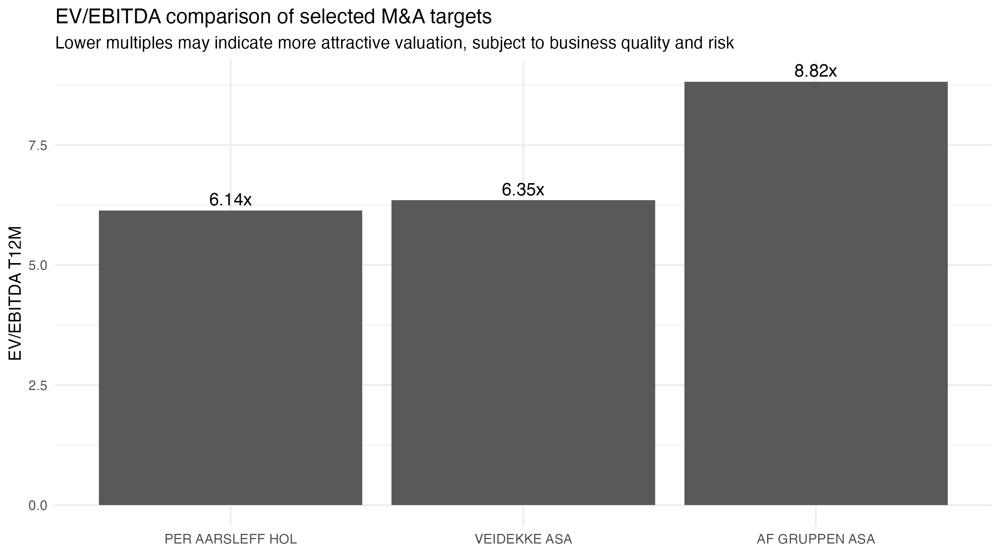
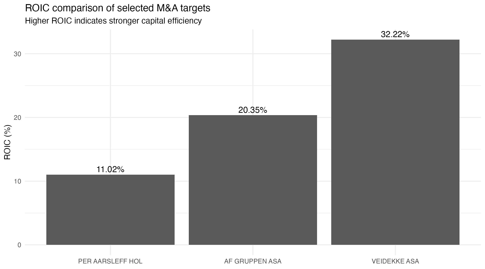
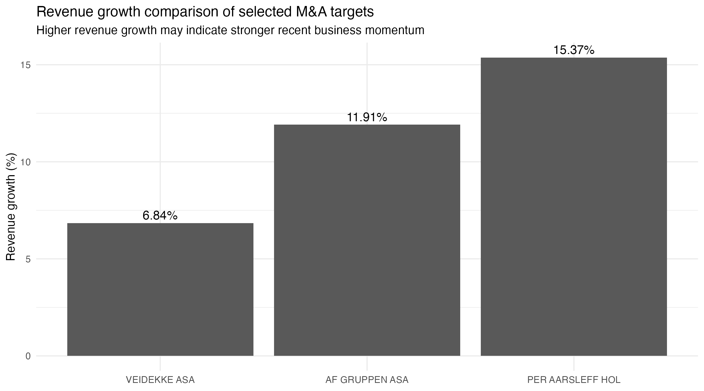

```{r setup, include=FALSE}
library(readr)
library(dplyr)
library(knitr)
library(ggplot2)

final_targets_table <- read_csv("final_targets_table.csv")
```

# Executive Summary

This project uses Bloomberg data and R to screen listed Nordic industrial companies for potential M&A targets. The final selected peer group consists of Veidekke ASA, AF Gruppen ASA, and Per Aarsleff Holding, with Veidekke ASA identified as the preferred target based on valuation, ROIC, growth, and leverage characteristics.

# Methodology

The dataset was exported from Bloomberg Terminal using the EQS equity screening function. The initial universe consisted of listed companies from Norway, Sweden, Denmark, and Finland, with financial, valuation, profitability, growth, liquidity, and balance sheet data collected for each company.

The project was then narrowed to Nordic industrial companies to create a more comparable peer universe. Companies with missing valuation data, negative or extreme valuation multiples, abnormal profitability margins, weak recent revenue trends, excessive leverage, or very small market capitalisation were removed.

The attractiveness score was built using five categories: valuation, profitability, growth, leverage, and market signal. Each company received percentile-based scores for these factors, which were then weighted and combined into a final M&A attractiveness score.

The score weights were chosen to reflect an initial M&A screening perspective rather than a final investment recommendation. Valuation was given the highest weight because acquisition attractiveness is strongly influenced by entry multiple, while profitability, growth, leverage, and market signal were included to avoid selecting companies that are cheap only because of weak fundamentals or excessive risk.

The percentile-based scoring model ranks each company relative to the filtered peer universe. As a result, scores can change when the universe is narrowed, not because the company’s fundamentals change, but because the relevant comparison group changes. This is appropriate for a screening model, but the results should be interpreted as relative rankings within the selected universe rather than absolute measures of company quality.

The final shortlist was not selected purely by numerical rank. Veidekke ASA, AF Gruppen ASA, and Per Aarsleff Holding were selected because they are construction and infrastructure-related companies with more comparable business models, margin structures, and valuation drivers. This avoids comparing companies across fundamentally different industrial sub-sectors such as airlines, shipping, services, and construction.

# Final Target Comparison

```{r target-table, echo=FALSE}
kable(final_targets_table)
```


# Valuation Comparison

Per Aarsleff and Veidekke trade at the lowest EV/EBITDA multiples among the three selected targets, while AF Gruppen trades at a higher multiple. This suggests that Veidekke and Per Aarsleff appear cheaper on an earnings-based valuation measure, although valuation must be considered together with profitability, growth, and risk.

```{r valuation-chart, echo=FALSE, out.width="90%"}

```

# ROIC Comparison

Veidekke has the highest ROIC among the selected targets, indicating stronger capital efficiency relative to AF Gruppen and Per Aarsleff. This is one of the strongest arguments supporting Veidekke as the preferred target.

```{r roic-chart, echo=FALSE, out.width="90%"}

```

# Revenue Growth Comparison

Per Aarsleff shows the strongest revenue growth, followed by AF Gruppen and Veidekke. Veidekke’s growth is lower than the two peers, but remains positive and supports the view that the company is not simply a low-growth value case.

```{r growth-chart, echo=FALSE, out.width="90%"}

```

# Limitations

This project should be interpreted as an initial screening exercise rather than a final investment recommendation. The model relies on Bloomberg screening data and therefore depends on the accuracy and consistency of the exported fields. Market capitalisation is reported in local listing currency, so the size filter was mainly used to remove very small companies rather than to create a perfectly currency-adjusted threshold.

The model also does not include a full discounted cash flow valuation, detailed order backlog analysis, ownership structure review, customer concentration analysis, or transaction feasibility assessment. These areas would need to be examined in further due diligence before making a real investment or acquisition recommendation.

# Conclusion

The screening model identifies Veidekke ASA as the strongest candidate among the selected construction and infrastructure-related companies. The company combines attractive valuation, high ROIC, positive revenue growth, and a strong net cash position. However, the low EBITDA margin requires further due diligence, especially around project execution risk, cost sensitivity, and margin sustainability.


